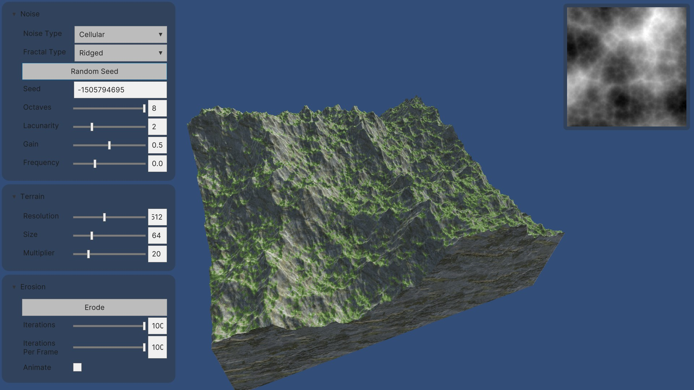
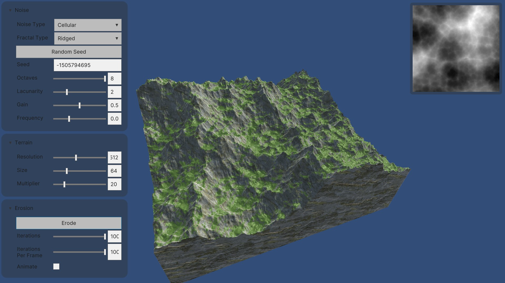

# Hydraulic Erosion Simulation in Unity

## Overview

This project implements a particle based erosion simulation.
The goal is to simulate the process of erosion in a terrain creating visually appealing landscapes.
Both the erosion and procedural terrain generation run on the GPU.

### Unity Editor Version

- 2022.3.4f1 or later

## Screenshoots

  
   
  <em>Droplets - 0 512x512</em>

  
   
  <em>Droplets - 100.000 512x512</em>

  
   
  <em>Droplets - 200.000 512x512</em>

